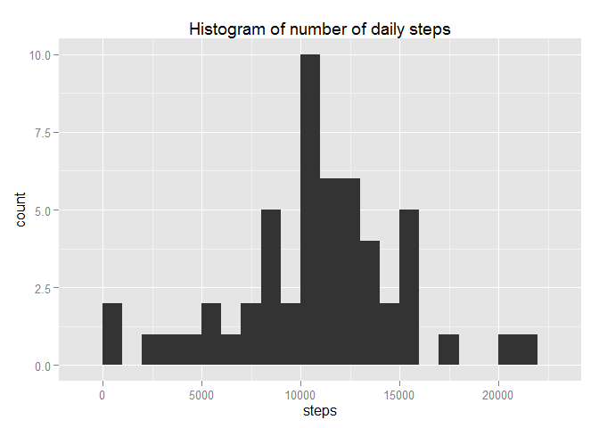
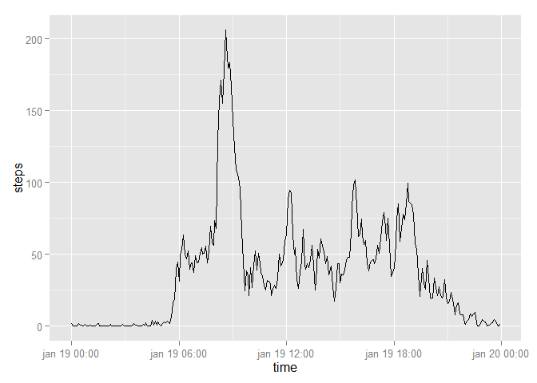
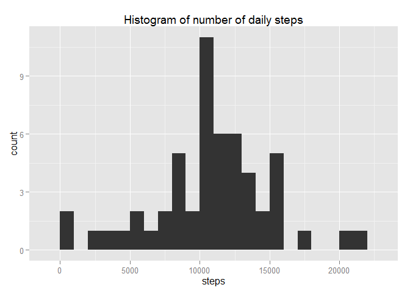
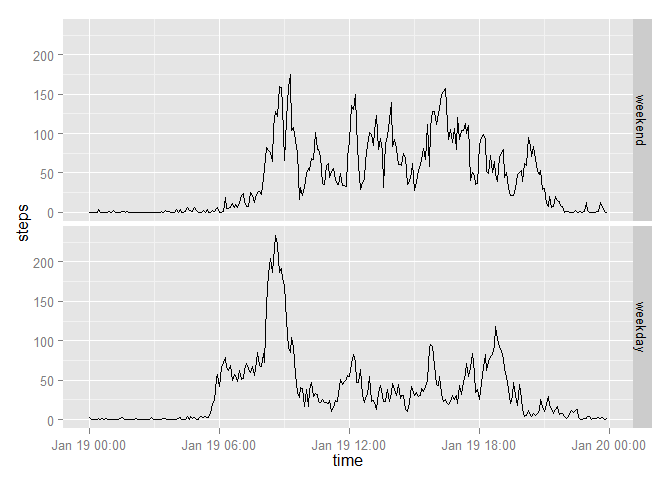

# Reproducible Research: Peer Assessment 1


## Loading and preprocessing the data

The data from a personal activity monitoring device during the months of October and November, 2012 is loaded (and unziped) and preprocessed. The first five rows of the data is printed to give an idea of how the data looks.

```r
unzip("activity.zip")
data <- read.csv("activity.csv")
library(stringr)
data$interval <- str_pad(data$interval, 4, pad = "0")
data$time <- paste(str_sub(data$interval, 1, 2), str_sub(data$interval, 3, 4), "00", sep = ":")
data$time <- as.POSIXct(paste(data$date, data$time), format="%Y-%m-%d %H:%M:%S")
data$date <- as.Date(data$date)
head(data)
```

```
##   steps       date interval                time
## 1    NA 2012-10-01     0000 2012-10-01 00:00:00
## 2    NA 2012-10-01     0005 2012-10-01 00:05:00
## 3    NA 2012-10-01     0010 2012-10-01 00:10:00
## 4    NA 2012-10-01     0015 2012-10-01 00:15:00
## 5    NA 2012-10-01     0020 2012-10-01 00:20:00
## 6    NA 2012-10-01     0025 2012-10-01 00:25:00
```


## What is mean total number of steps taken per day?

First we draw a histogram of the total number of steps taken each day that shows the distribution of the daily steps. A "binwidth" of 1000 is used. Note that the distribution almost look like a normal distribution.

```r
library(ggplot2)
daily_totals <- aggregate(steps ~ date, data=data, sum)
qplot(steps, data = daily_totals, binwidth = 1000, main = "Histogram of number of daily steps")
```

 

We can calculate the mean and the median of the daily steps take in the following way:

```r
mean(daily_totals$steps)
```

```
## [1] 10766.19
```

```r
median(daily_totals$steps)
```

```
## [1] 10765
```


## What is the average daily activity pattern?

We will start by making a time series plot of the 5-minute interval and the average number of steps taken, averaged across all days:

```r
library(ggplot2)
an_average_day <- aggregate(steps ~ interval, data=data, FUN=mean, na.rm = TRUE)
an_average_day$time = paste(str_sub(an_average_day$interval, 1, 2), str_sub(an_average_day$interval, 3, 4), "00", sep = ":")
an_average_day$time <- as.POSIXct(an_average_day$time, format=" %H:%M")
g <- ggplot(data = an_average_day, aes(x = time, y = steps), scale_x_datetime(labels = date_format("%H:%M")))
g + geom_line()
```

 

The 5-minute interval, on average across all the days in the dataset, that contains the maximum number of steps can be calculated in the following way:

```r
start_time <- strftime(an_average_day[which.max(an_average_day$steps), "time"], format="%H:%M")
end_time <- strftime(an_average_day[which.max(an_average_day$steps), "time"] + 5 * 60, format="%H:%M")
paste("from", toString(start_time), "to", toString(end_time))
```

```
## [1] "from 08:35 to 08:40"
```


## Imputing missing values

The number of missing data in the dataset, i.e. number of times "steps" was reported as N.A., is calculated in the following way

```r
length(which(is.na(data$steps)))
```

```
## [1] 2304
```

From the following command we can see that "steps" is in fact the only variable with missing values

```r
colSums(is.na(data))
```

```
##    steps     date interval     time 
##     2304        0        0        0
```

To fill in the missing data, the mean of the 5-minutes interval from the previous part of the assignment is used. If the average of a 5-minute interval is it self missing, 0 is filled in. The following code does exactly this and store the new filled-in missing value data as "new_data"

```r
new_data <- data
new_data$steps <- ifelse(is.na(new_data$steps), an_average_day[an_average_day$interval == new_data$interval, 2 ], new_data$steps)
```


As in first part of the assignment, we draw a histogram of the total number of steps taken each day. A "binwidth" of 1000 is used again.

```r
daily_totals_new <- aggregate(steps ~ date, data=new_data, sum)
qplot(steps, data = daily_totals_new, binwidth = 1000, main = "Histogram of number of daily steps")
```

 

Again, we can calculate the mean and the median of the daily steps taken in the new filled-in dataset in the following way:

```r
mean(daily_totals_new$steps)
```

```
## [1] 10766.19
```

```r
median(daily_totals_new$steps)
```

```
## [1] 10765.59
```

While the scale on the y-axis look a little different, the distribution is the same and so is the mean. This is of course expected as we have used the means at the 5-minutes interval to fill in for missing vaules and adding extra values that are equal to the mean do not affect the mean.

The median is a little of because we have used non-integer mean values to fill in missing values. However, rounding to whole numbers give the same median. 


## Are there differences in activity patterns between weekdays and weekends?


```r
head(new_data)
```

```
##       steps       date interval                time
## 1 1.7169811 2012-10-01     0000 2012-10-01 00:00:00
## 2 0.3396226 2012-10-01     0005 2012-10-01 00:05:00
## 3 0.1320755 2012-10-01     0010 2012-10-01 00:10:00
## 4 0.1509434 2012-10-01     0015 2012-10-01 00:15:00
## 5 0.0754717 2012-10-01     0020 2012-10-01 00:20:00
## 6 2.0943396 2012-10-01     0025 2012-10-01 00:25:00
```

```r
Sys.setlocale("LC_TIME", "English")
```

```
## [1] "English_United States.1252"
```

```r
new_data$weekday <- weekdays(new_data$time)
head(new_data)
```

```
##       steps       date interval                time weekday
## 1 1.7169811 2012-10-01     0000 2012-10-01 00:00:00  Monday
## 2 0.3396226 2012-10-01     0005 2012-10-01 00:05:00  Monday
## 3 0.1320755 2012-10-01     0010 2012-10-01 00:10:00  Monday
## 4 0.1509434 2012-10-01     0015 2012-10-01 00:15:00  Monday
## 5 0.0754717 2012-10-01     0020 2012-10-01 00:20:00  Monday
## 6 2.0943396 2012-10-01     0025 2012-10-01 00:25:00  Monday
```

```r
new_data$part_of_week <- ifelse(new_data$weekday == "Saturday" | new_data$weekday == "Sunday", 0, 1)
new_data$part_of_week <- factor(new_data$part_of_week, labels = c("weekend", "weekday"))
```

We can now make a panel plot containing a time series plot of the 5-minute interval (x-axis) and the average number of steps taken, averaged across all weekday days or weekend days (y-axis):

```r
new_average_day <- aggregate(steps ~ interval + part_of_week, data=new_data, FUN=mean, na.rm = TRUE)
new_average_day$time = paste(str_sub(new_average_day$interval, 1, 2), str_sub(new_average_day$interval, 3, 4), "00", sep = ":")
new_average_day$time <- as.POSIXct(new_average_day$time, format=" %H:%M")
g <- ggplot(data = new_average_day, aes(x = time, y = steps), scale_x_datetime(labels = date_format("%H:%M")))
g + geom_line() + facet_grid(part_of_week ~ .)
```

 


